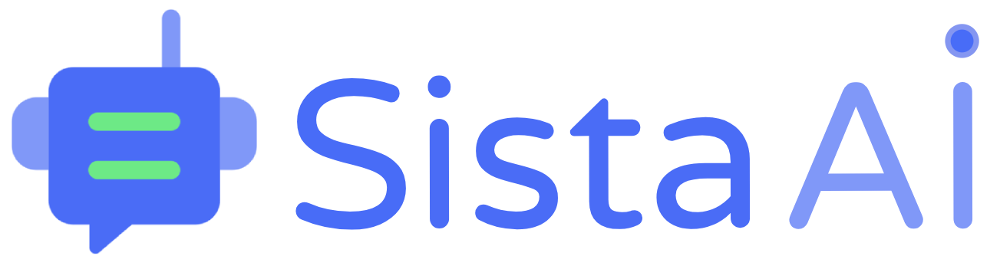
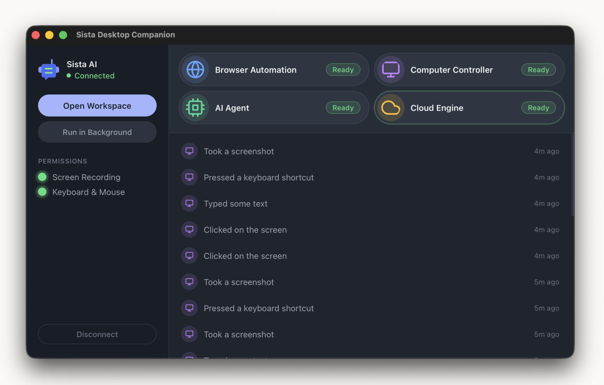

	

<h1 align="center">Sista AI Desktop Companion</h1>

	<strong>AI agents that use your browser and control your computer.</strong> 
	The official desktop companion for the <a href="https://work.sista.ai">Sista AI Workforce Platform</a> — 
	a production-grade <em>browser use</em> + <em>computer use</em> runtime for AI agents, running locally on your machine.

	<a href="https://sista.ai">sista.ai</a> ·
	<a href="https://work.sista.ai">work.sista.ai</a> ·
	<a href="https://github.com/sista-ai/ai-employee-download/releases/latest">Download Latest</a>

	

	
		<code>ai agent</code> ·
		<code>ai agents</code> ·
		<code>browser use</code> ·
		<code>computer use</code> ·
		<code>browser automation</code> ·
		<code>computer control</code> ·
		<code>desktop agent</code> ·
		<code>agent orchestration</code> ·
		<code>multi-agent</code> ·
		<code>llm agents</code> ·
		<code>autonomous agents</code> ·
		<code>ai workforce</code> ·
		<code>ai employees</code>
	

---

## What this is

**Sista AI Desktop Companion** is a native desktop app (macOS, Windows, Linux) that acts as the **local execution runtime for AI agents**. It gives autonomous AI agents — running in the [Sista AI](https://work.sista.ai) cloud — real hands on your machine: full browser use, computer use, file access, and terminal execution.

If you've seen *Browser Use*, *Anthropic Computer Use*, *OpenAI Operator*, or similar *agent orchestration* research, this is a production-grade version of that idea, wired into a full AI workforce platform. The cloud runs the **brain** (reasoning, memory, multi-agent coordination, sprint planning). This app is the **hands** (browser, keyboard, mouse, files, shell).

### What the AI agents can do through this app

- **Browser use** — navigate any website, click, type, fill forms, extract structured data, complete end-to-end tasks in your real browser with your real logged-in sessions (Gmail, Slack, Notion, Linear, GitHub, Figma, Shopify, Stripe, you name it)
- **Computer use / computer control** — take screenshots, move the mouse, press keys, control native desktop apps the same way a human would
- **File system access** — read, write, and organize files in your home directory (sandboxed)
- **Terminal / shell execution** — run commands, scripts, CLIs with destructive-command protection
- **Multi-agent delegation** — the platform's team leaders delegate sub-tasks to specialist agents, each of which can use this app as their hands

## Hire AI like you hire humans

[work.sista.ai](https://work.sista.ai) is a marketplace where you **hire AI employees and AI teams** the way you'd hire humans. Pick a team — Marketing, Sales, or build your own — and you land in a chat with the team leader. Tell them what you need: *"I'm launching a new product and need content marketing that drives organic traffic."* They ask the right questions, connect to your tools, plan sprints, delegate to specialists, and deliver work in recurring cycles.

Each employee is a fully autonomous LLM agent with persona, skills, duties, long-term memory, a knowledge graph, and access to 900+ tool integrations. Teams coordinate through agent-to-agent delegation. Every employee can pick up this Desktop Companion as a tool — that's when they stop being just a chatbot and start actually doing things on your machine.

- **Teams, not single chatbots** — Marketing, Sales, custom — 7+ specialists per team, coordinated by an AI team leader
- **Sprint-based delivery** — plan → execute → review → self-correct, automatically
- **Conversation-first** — one chat with the leader is enough, no workflow builder
- **900+ OAuth tool integrations** — Gmail, Slack, Notion, Salesforce, HubSpot, Stripe, Shopify, GitHub, Linear, and more
- **Multi-layer agent memory** — short-term, long-term, knowledge graph, episodic, procedural, shared, adaptive
- **Built-in governance** — guardrails, approval gates, audit trails, SOC 2 / GDPR / EU AI Act ready
- **Credit-based SaaS** — Free, Pro, Team, Scale, Enterprise

## Why you need this app

The cloud can't reach your logged-in accounts, your local files, or your terminal. This app is what turns a cloud chatbot into an **autonomous desktop agent** that actually gets work done on your machine.

Install it once, sign in once, and every AI employee you've hired on [work.sista.ai](https://work.sista.ai) gets hands on your computer — under your rules.

## You stay in control

- **Approval gates** — mark sensitive actions so the agent has to ask before doing them
- **Dangerous command blocking** — `rm -rf /`, `dd`, `mkfs`, `shutdown`, `sudo`, fork bombs, and similar patterns are refused at the app level before they ever run
- **File sandboxing** — file access is restricted to your home directory
- **No password handling** — agents use sessions you're already logged into; they never see or store your credentials
- **Encrypted connection** — authenticated TLS WebSocket tied to your Sista AI account
- **Quit anytime** — close the app and your agents lose their hands instantly

## Download

Grab the latest installer for your operating system:

| OS       | Installer                      | Download                                                                                                           |
| -------- | ------------------------------ | ------------------------------------------------------------------------------------------------------------------ |
| macOS    | `Sista-Mac-Desktop.dmg`        | [Download](https://github.com/sista-ai/ai-employee-download/releases/latest/download/Sista-Mac-Desktop.dmg)        |
| Windows  | `Sista-Windows-Desktop.msi`    | [Download](https://github.com/sista-ai/ai-employee-download/releases/latest/download/Sista-Windows-Desktop.msi)    |
| Linux    | `Sista-Linux-Desktop.AppImage` | [Download](https://github.com/sista-ai/ai-employee-download/releases/latest/download/Sista-Linux-Desktop.AppImage) |

All releases: [github.com/sista-ai/ai-employee-download/releases](https://github.com/sista-ai/ai-employee-download/releases)

## Install & Connect

1. Download the installer for your OS from the table above
2. Install and launch **Sista AI Desktop Companion**
3. Click **Sign in with Sista AI** — your browser opens to [work.sista.ai](https://work.sista.ai), you approve, and the app connects automatically
4. Grant the required OS permissions (Screen Recording + Accessibility on macOS, equivalents on other OSes)
5. Head back to [work.sista.ai](https://work.sista.ai) — your AI agents now have hands

## Use Cases

- **Autonomous web tasks** — agents log into SaaS apps you already use and complete end-to-end flows
- **Data extraction** — structured extraction from any website using real authenticated sessions
- **Sales outreach** — research prospects, draft messages in your CRM, send via your account
- **Marketing execution** — publish posts, schedule campaigns, update your CMS
- **Customer support** — triage tickets, draft responses, update tickets in your helpdesk
- **Research workflows** — deep research across logged-in tools, with local file output
- **Dev workflows** — agents running CLI tools, reading logs, editing files under supervision

## Related terms people search for

AI agents, autonomous agents, LLM agents, agentic AI, agent orchestration, multi-agent systems, agent-to-agent delegation, browser use, computer use, Anthropic computer use, OpenAI Operator, Browser Use library, Playwright agent, desktop agent, computer control, browser automation, AI assistant for desktop, AI employee, AI workforce, AI workforce platform, AI team, AI teammate, hire AI, AI for business, LangGraph agent, LangChain agent, Temporal workflows, self-hosted AI agent runtime.

## Links

- Company — [sista.ai](https://sista.ai)
- Product — [work.sista.ai](https://work.sista.ai)
- Latest release — [releases/latest](https://github.com/sista-ai/ai-employee-download/releases/latest)

---

	© Sista AI · Hire AI like you hire humans.

